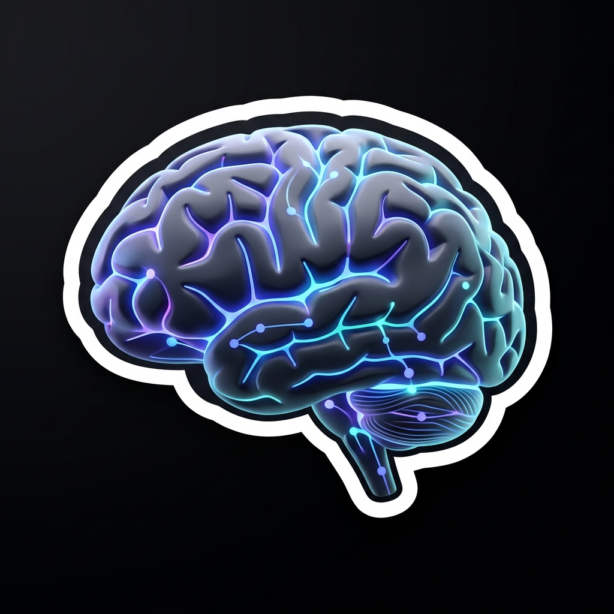

  

<!--

  

-->

 

# 👋 Hi, I'm Samuel Byiringiro
Welcome to my GitHub profile!

---

## 🧠 Know About Me

<table align="center" border="0">
  <tr>
    <td width="30%" align="center">
      
    </td>
    <td width="70%">
      

        I am a passionate software developer dedicated to crafting scalable, efficient, and beautifully designed digital experiences. With expertise in modern web technologies, I bridge the gap between complex functionality and user-friendly interfaces.
      

    </td>
  </tr>
</table>

---

## 🎨 What I Do

- 📱 **Mobile Development**
- 💻 **Fullstack Web Development**
- 📊 **Database Architecture**
- ☁️ **Cloud Infrastructure & DevOps**
- 🔗 **API Design & Distributed System Architecture**
- 🧪 **Continuous Learning & Tech Exploration**

---

## 🛠️ Languages & Tools

### 🌐 Frontend & Mobile

### ⚙️ Backend & Systems

### 🗄️ Database & Cloud

### 🚀 DevOps & Infrastructure

---

## 🚀 Latest Activity

I'm constantly working on innovative projects that merge technology and creativity.
Check out my repositories to explore my latest work, experiments, and open-source contributions.

---

## Let's Connect

I'm always open to collaboration and sharing ideas.

- 📧 [byiringirosamuel533@gmail.com](mailto:byiringirosamuel533@gmail.com)
- 🌐 [Portfolio](https://bsamuel.vercel.app/)
- 📸 [Instagram](https://instagram.com/byiringirosamuel74)

---

  

**Building Scalable Systems • Designing Impactful Experiences • Shaping the Future**

 

<blockquote align="center">
  
Code is never finished. It only becomes slightly less terrible over time.

</blockquote>

<blockquote align="center">
  
Every commit I make is essentially just a small, desperate apology to my future self.

</blockquote>

 

